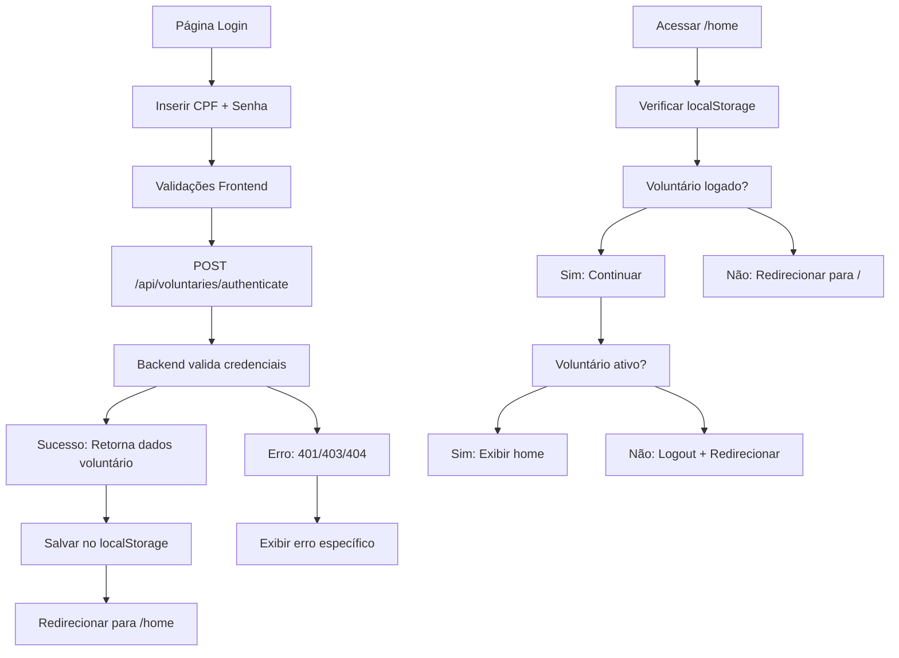

# 🔐 Implementação de Autenticação - Sistema de Login

## ✅ Implementação Frontend Concluída

### **📋 Endpoint Necessário no Backend**

Você precisará implementar este endpoint no backend:

```java
@PostMapping("/api/voluntaries/authenticate")
public ResponseEntity<AuthResponseDto> authenticate(@RequestBody AuthRequestDto authRequest) {
    // Lógica de autenticação aqui
}
```

#### **DTOs Necessários:**

**AuthRequestDto:**

```java
public class AuthRequestDto {
    @NotBlank
    private String cpf;

    @NotBlank
    private String password;

    // getters e setters
}
```

**AuthResponseDto:**

```java
public class AuthResponseDto {
    private UUID voluntaryId;
    private String name;
    private String email;
    private boolean active;
    private String message;

    // construtores, getters e setters
}
```

#### **Lógica Sugerida para o Endpoint:**

1. Receber CPF e senha do AuthRequestDto
2. Buscar pessoa por CPF usando PersonRepository
3. Verificar se pessoa está associada a um voluntário ativo
4. Validar senha (você pode usar BCrypt ou similar)
5. Retornar AuthResponseDto com dados do voluntário ou erro 401/403

---

## 🔧 **Implementação Frontend Realizada**

### **1. Serviço de Autenticação** (`authService.js`) - ✅ NOVO

- **Método principal**: `autenticarVoluntario(cpf, senha)`
- **Endpoint**: `POST /api/voluntaries/authenticate`
- **Armazenamento**: localStorage para dados do voluntário logado
- **Métodos implementados**:
  - `autenticarVoluntario()` - Login com CPF e senha
  - `getVoluntarioLogado()` - Recuperar dados do voluntário logado
  - `logout()` - Limpar sessão
  - `isLoggedIn()` - Verificar se está logado

### **2. Página de Login** (`page.js`) - ✅ ATUALIZADA

- **Campos atualizados**: CPF (11 dígitos) + Senha (min. 6 caracteres)
- **Validações implementadas**:
  - CPF com exatamente 11 dígitos
  - Senha com mínimo 6 caracteres
  - Campos obrigatórios
- **Integração com API**: Substituído senha fixa "1234" por autenticação real
- **Tratamento de erros específicos**:
  - 401: CPF ou senha incorretos
  - 403: Voluntário inativo
  - 404: Voluntário não encontrado
  - 500: Erro do servidor

### **3. Página Home** (`home/page.js`) - ✅ ATUALIZADA

- **Verificação de autenticação**: Redireciona para login se não logado
- **Verificação de status**: Bloqueia voluntários inativos
- **Personalização**: Exibe nome do voluntário logado
- **Loading state**: Tela de carregamento durante verificação

### **4. MenuBar** (`components/menubar/menubar.js`) - ✅ ATUALIZADA

- **Nome do voluntário**: Exibe nome real do voluntário logado
- **Botão de logout**: Funcional com confirmação
- **Funcionalidade de logout**: Limpa sessão e redireciona

---

## 🔄 **Fluxo de Autenticação Implementado**



---

## 🛡️ **Recursos de Segurança Implementados**

### **Frontend**

- ✅ **Validação de entrada**: CPF e senha
- ✅ **Limpeza de dados**: Remove caracteres especiais do CPF
- ✅ **Verificação contínua**: Todas as páginas verificam autenticação
- ✅ **Logout seguro**: Limpa dados locais
- ✅ **Status do voluntário**: Bloqueia inativos automaticamente

### **Armazenamento Local**

- ✅ **localStorage**: Dados básicos do voluntário (não sensíveis)
- ✅ **Limpeza automática**: Remove dados em caso de erro
- ✅ **Validação**: Verifica integridade dos dados armazenados

---

## 📱 **Interface Atualizada**

### **Página de Login**

- Campo CPF: Aceita apenas números, máximo 11 dígitos
- Campo Senha: Mínimo 6 caracteres, type="password"
- Botão: Mostra "Entrando..." durante loading
- Título: "Login do Voluntário" para clareza

### **Página Home**

- Saudação personalizada: "Bem-vindo à Sanem, {Nome}!"
- Verificação de carregamento: "Verificando autenticação..."
- MenuBar: Nome real do voluntário + logout funcional

---

## 🎯 **Próximos Passos**

1. **Implementar o endpoint no backend** com a estrutura sugerida
2. **Testar autenticação** com voluntários cadastrados
3. **Opcional**: Implementar token JWT para segurança adicional
4. **Opcional**: Adicionar "Esqueci minha senha" funcional

---

## 📝 **Observações Técnicas**

- Mock da senha "1234" foi **comentado** (preservado para referência)
- Sistema **compatível** com estrutura existente de voluntários
- **Reutiliza** endpoints existentes quando possível
- **Não quebra** funcionalidades existentes
- Design **totalmente preservado**

---

O sistema de autenticação está pronto no frontend! Basta implementar o endpoint `/api/voluntaries/authenticate` no backend conforme especificado acima.
