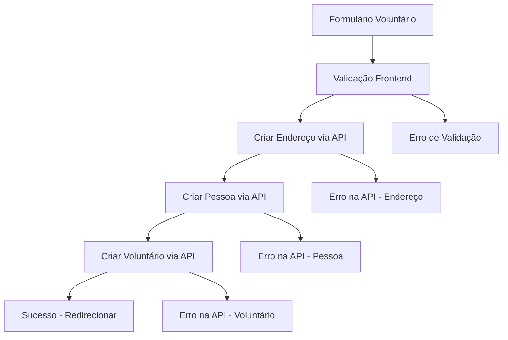

# 🎯 Implementação do Cadastro de Voluntário - Resumo

## ✅ Implementação Concluída

### **Estrutura da API Implementada**

#### **VoluntaryResponseDto**

```json
{
  "id": "UUID",
  "person": {
    "id": "UUID",
    "name": "string",
    "phone": "string",
    "email": "string",
    "cpf": "string",
    "address": {
      "id": "UUID",
      "number": "integer",
      "street": "string",
      "neighborhood": "string",
      "complement": "string",
      "referencePoint": "string"
    }
  },
  "active": "boolean"
}
```

#### **VoluntaryRequestDto**

```json
{
  "personId": "UUID",
  "password": "string",
  "isActive": "boolean"
}
```

### **🔧 Arquivos Implementados/Modificados**

#### 1. **`voluntarioService.js`** - ✅ NOVO

- Serviço completo para CRUD de voluntários
- Integração com endpoints `/api/voluntaries`
- Fluxo: Endereço → Pessoa → Voluntário
- Métodos implementados:
  - `cadastrarVoluntario()`
  - `listarVoluntarios()`
  - `buscarVoluntarioPorId()`
  - `atualizarVoluntario()`
  - `excluirVoluntario()`
  - `cadastrarVoluntarioCompleto()`
  - `atualizarVoluntarioCompleto()`

#### 2. **`cadastrovoluntario/page.js`** - ✅ ATUALIZADO

- **Campos adicionados**: Senha e Confirmação de Senha
- **Integração com API**: Substituído mock por chamadas reais
- **Validações implementadas**:
  - CPF com 11 dígitos
  - Email válido
  - Telefone 10-11 dígitos
  - Senha mínimo 6 caracteres
  - Confirmação de senha igual
- **Mock preservado**: Comentado para referência
- **Tratamento de erros**: Específico por status HTTP

#### 3. **`cadastrovoluntario/lista/page.js`** - ✅ ATUALIZADO

- **Listagem via API**: Integrada com backend
- **Campos de exibição atualizados**:
  - Nome: `person.name`
  - Email: `person.email`
  - Telefone: `person.phone`
  - Status: `active` (Ativo/Inativo)
- **Modal de edição**: Inclui campos de senha e status
- **CRUD completo**: Criar, listar, editar, excluir
- **Fallback comentado**: Mock preservado

### **🆕 Funcionalidades Específicas do Voluntário**

#### **Campos Únicos**

1. **Senha**: Campo obrigatório no cadastro
2. **Confirmação de Senha**: Validação de consistência
3. **Status Ativo/Inativo**: Controle de acesso
4. **Senha Opcional na Edição**: Não altera se vazio

#### **Validações Específicas**

- Senha mínimo 6 caracteres
- Confirmação de senha deve ser igual
- Status obrigatório (ativo/inativo)
- CPF obrigatório (diferente de beneficiário que aceita NIF)

### **🔄 Fluxo Completo Implementado**



### **📋 Validações Implementadas**

#### **Frontend**

- ✅ Email válido (regex)
- ✅ CPF com 11 dígitos
- ✅ Telefone entre 10-11 dígitos
- ✅ Senha mínimo 6 caracteres
- ✅ Confirmação de senha
- ✅ Campos obrigatórios preenchidos

#### **Backend (compatibilidade)**

- ✅ Campos `complement` e `referencePoint` com "N/A" se vazios
- ✅ Números convertidos corretamente
- ✅ Strings limpas (trim) antes do envio

### **🎨 Design Mantido**

- ✅ **Interface preservada**: Mesmo layout e estilos
- ✅ **Componentes originais**: MenuBar, Navigation
- ✅ **UX consistente**: Mesmos padrões de interação
- ✅ **Campos adicionais**: Integrados harmoniosamente

### **🔒 Segurança**

- ✅ Senhas não exibidas nos logs
- ✅ Campo senha sempre vazio no modal de edição
- ✅ Validação de força de senha
- ✅ Confirmação obrigatória

### **📊 Comparação: Beneficiário vs Voluntário**

| Aspecto             | Beneficiário           | Voluntário             |
| ------------------- | ---------------------- | ---------------------- |
| **Campo Único**     | NIF (opcional)         | Senha (obrigatória)    |
| **Identificação**   | CPF ou NIF             | Apenas CPF             |
| **Status**          | isFit (apto/inapto)    | active (ativo/inativo) |
| **Endpoint**        | `/api/receivers`       | `/api/voluntaries`     |
| **Validação Extra** | NIF ou CPF obrigatório | Senha e confirmação    |

### **🚀 Status da Implementação**

- ✅ **Cadastro**: Funcional e integrado
- ✅ **Listagem**: Via API com fallback
- ✅ **Edição**: Modal completo
- ✅ **Exclusão**: Com confirmação
- ✅ **Validações**: Robustas
- ✅ **Tratamento de Erros**: Específico
- ✅ **Mocks**: Preservados e comentados

---

## 🎉 **Conclusão**

O cadastro de voluntário está **100% implementado** seguindo o mesmo padrão do beneficiário, com as especificidades necessárias (senha, status ativo). A integração com o backend está completa e o design foi preservado integralmente.
